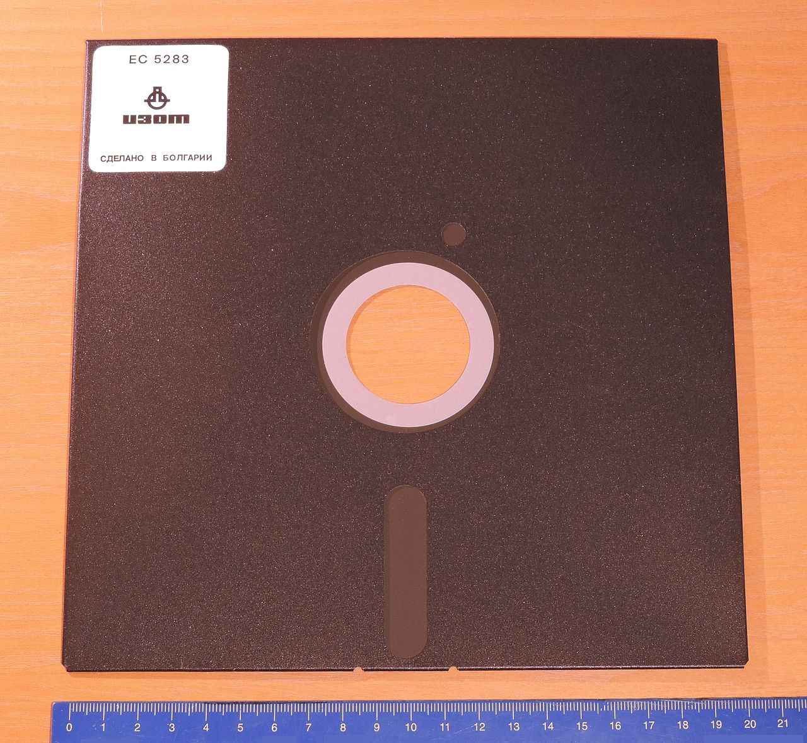
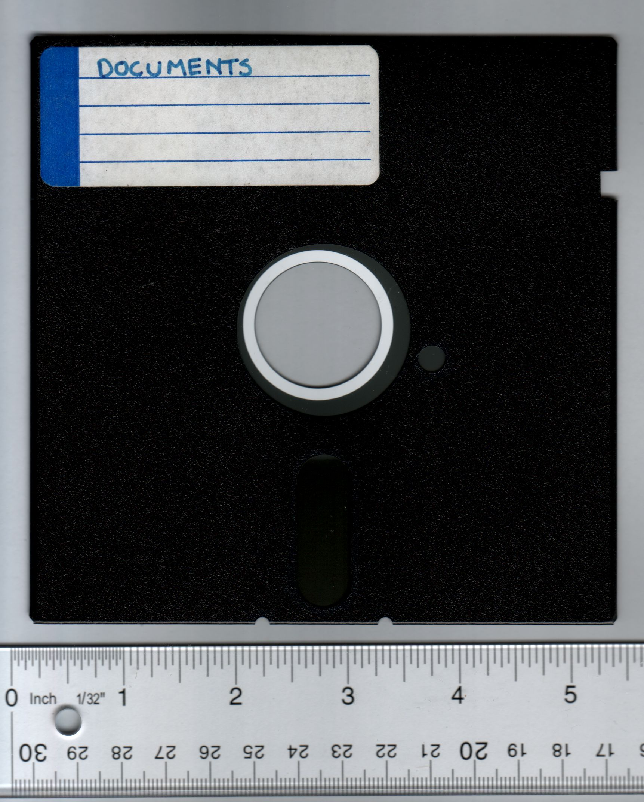
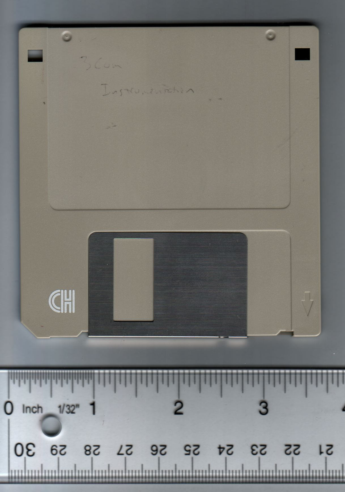

| [ Home ](index.html) | [ Media ID Guide ](media_ID.html) | [ Operating Systems ](operating_systems.html) | [ Emulation ](emulators.html) | [ Resources ](resources.html) |

 

# Media and Hardware Identification Guide

If you are unsure what formats you currently possess, use the images below to help identify your objects.  

_Note: This list is not exhaustive! Check out the [Museum of Obsolete Media](http://www.obsoletemedia.org/) for more formats than are listed here._  

## What format(s) do you have in your collection?

- <a href="#optical">Round discs</a>
- <a href="#floppy">Floppy disks</a>
- <a href="#sony">Some unknown Sony format</a>
- <a href="#cartridge">Other cartridge-based media</a>
- <a href="#something-else">None of the above</a>

### Optical disc media  
Compact Disc (CD, CD-R, CD-RW, CD-ROM)  
Digital Video Disc (DVD, DVD-R, DVD-RW, DVD-ROM, DVD-RAM)  
Blu-Ray disc   

### Floppy disks  
Consider using <a href="https://www.kryoflux.com/" target="_blank">Kryoflux</a> to obtain a disk image of your floppy disk if you do not know the exact file system of your media. Check out <a href="https://docs.google.com/document/d/1LViSnYpvr2jf1TrCh6ELuL-FWo14ICw-WZeb8j5GGpU/edit" target="_blank">The Archivist's Guide to Kryoflux</a> for further details.
<table style="width:100%">
  <tr>
    <th>Image</th>
    <th>Format Name</th> 
    <th>Description</th>
    <th>Preservation Resources</th>
  </tr>
  <tr>
    <td></td>
    <td>8" floppy disk</td> 
    <td>ca. 1970s; IBM-designed device, earliest version had a capacity of 80KB. Used primarily in corporate contexts.</td>
    <td><a href="http://openpreservation.org/blog/2016/09/01/an-8-floppy-disk-challenge/" target="_blank">An 8" Floppy Disk Challenge</a></td>
  </tr>
  <tr>
    <td></td>
    <td>5.25" floppy disk</td> 
    <td>ca. late 1970s-1980s; flexible, thin, square disk. Magnetic media, single or double-sided, with capacities up to 1.2MB</td>
    <td><a href="http://www.esocop.org/docs/HowToDiagnoseAndRepairIBMFloppy5.pdf" target="_blank">How To Diagnose and Repair an IBM floppy drive</a></td>
  </tr>
  <tr>
    <td></td>
    <td>3.5" floppy disk</td> 
    <td>ca. 1990s; Extremely common in personal and corporate computing. Rigid plastic disks, often with a write protection tab (engage this for archival purposes!). </td>
    <td><a href="https://practicaltechnologyforarchives.org/issue2_waugh/" target="_blank">"A Dogged Pursuit: Capturing Forensic Images of 3.5” Floppy Disks"</a></td>
  </tr>
</table>

3.5-inch floppy disk  
2-inch video floppy disk  
Floptical disk

### Proprietary Sony-specific Formats  
Magneto-Optical disk  
MiniDisc  
MD Data  
Professional Disc / Professional Disc for data  
Memory Stick  

### Cartridge-based media
Bernoulli disk  
DataPlay Disc  
Jaz disk  
PocketZip/Clik!  
REV disk  
Syquest disk  
Zip disk  
Zip U250 disk

### Other Removable Media
Android phones  
iPhones  
External hard drives  
Secure Digital (SD) Cards  
USB Sticks/Portable Flash Drives/Thumb drives   

## Finally...
If you decide against building a workstation yourself or only have a few objects from which to recover data, consider sending your media out to a trusted data recovery vendor.
