

| [ Home ](index.html) | [ Media ID Guide ](media_ID.html) | [ Operating Systems ](operating_systems.html) | [ Emulation ](emulators.html) | [ Resources ](resources.html) |

# Media and Hardware Identification Guide

If you are unsure what formats you currently possess, use the images below to help identify your objects. Click to enlarge images and hover over images for source URLs.

_Note: This list is by no means exhaustive! Check out the [Museum of Obsolete Media](http://www.obsoletemedia.org/) for more formats than are listed here._

## What format(s) do you have in your collection?

- <a href="#optical">Round optical discs</a>
- <a href="#floppy">Floppy disks</a>
- <a href="#sony">Some unknown Sony format</a>
- <a href="#cartridge">Other cartridge-based media</a>
- <a href="#something-else">None of the above</a>
- <a href="#hardware">I know what formats I have; tell me about hardware, cabling, and adapters</a>

### Optical disc media
Typically, -R and -RW versions are much more fragile than their commercial read-only counterparts. Fortunately, archivists have written a great deal about optical media preservation, since CDs and CD-Rs are so prevelant in archival collections.
<table style="width:100%">
  <tr>
    <th>Image</th>
    <th>Format Name</th>
    <th>Description</th>
    <th>Preservation Resources</th>
  </tr>
  <tr>
    <td><a href="images/full-sized/cdrw.jpg">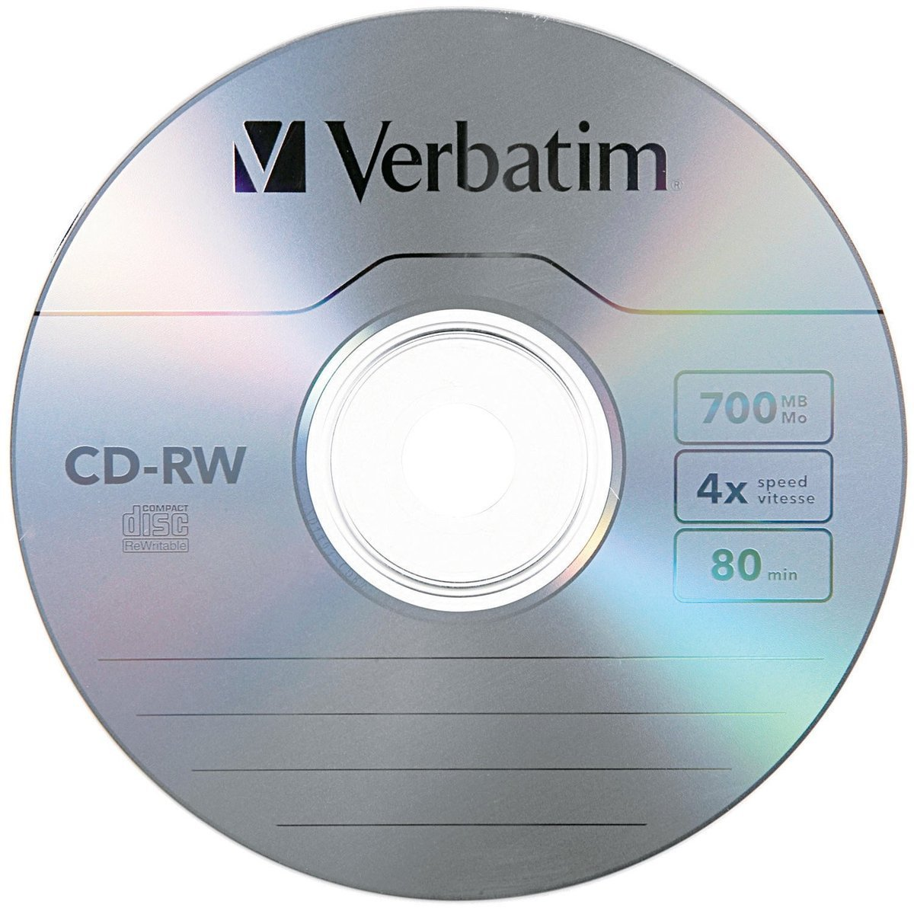</a></td>
    <td>Compact Disc</td>
    <td>ca. 1980s-present; The ubiquitous optical format. Numerous varieties, including writeable formats CD-R and CD-RW. A standard CD was introduced for the playback of audio formats.</td>
    <td><a href="http://www.naa.gov.au/information-management/managing-information-and-records/preserving/CDs-and-DVDs.aspx" target="_blank">NAA</a>, <a href="https://www.loc.gov/preservation/scientists/projects/cd-r_dvd-r_rw_longevity.html" target="_blank">LoC</a>, <a href="https://blogs.loc.gov/thesignal/2014/02/getting-public-radios-legacy-off-ageing-rewritable-cds-an-interview-with-wnycs-john-passmore/" target="_blank">LoC/WNYC</a>, <a href="http://campuspress.yale.edu/borndigital/2016/12/20/to-image-or-copy-the-compact-disc-digital-audio-dilemma/" target="_blank">Yale</a></td>
  </tr>
  <tr>
    <td><a href="images/full-sized/cd_rom.jpg">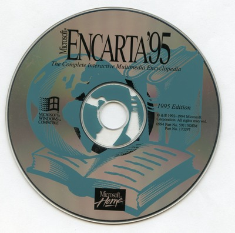</a></td>
    <td>CD-ROM</td>
    <td>ca. 1980s-1990s; Optical format for data storage, most commonly used for software--programs, video games, artworks. May require more involved a preservation effort than a standard audio CD.</td>
    <td><a href="https://pdfs.semanticscholar.org/6d1b/347b94e2d132a5830fb688c37a4a93f3c8a2.pdf" target="_blank">"Characterization of CD-ROMs for Emulation-based Access"</a>, <a href="https://www.loc.gov/preservation/scientists/projects/cd_longevity.html" target="_blank">LoC</a>, <a href="http://www.ncdd.nl/wp-content/uploads/2015/11/201611_DE_Houdbaar_Final_report_CD-ROM_Archiving_DEF.pdf" target="_blank">NCDD</a></td>
  </tr>
  <tr>
    <td><a href="images/full-sized/dvd_rw.jpg">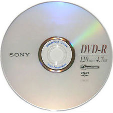</a></td>
    <td>DVD</td>
    <td>ca. late 1990s-present; optical media for video playback. Numerous varieties, including writable DVD-R and DVD-RW, DVD-ROM, and DVD-RAM</td>
    <td><a href="https://siarchives.si.edu/blog/and-action-ins-and-outs-dvd-video-preservation" target="_blank">Smithsonian Institution Archives</a>, <a href="https://www.nyu.edu/tisch/preservation/program/student_work/2016fall/16f_2920_Oliveira_a2.pdf" target="_blank">MIAP paper by Caroline Olivera, 2016</a>, <a href="https://www.avpreserve.com/wp-content/uploads/2014/04/OpticalMediaPreservation.pdf" target="_blank">AV Preserve</a></td>
  </tr>
  <tr>
    <td><a href="images/full-sized/blu_ray.jpg">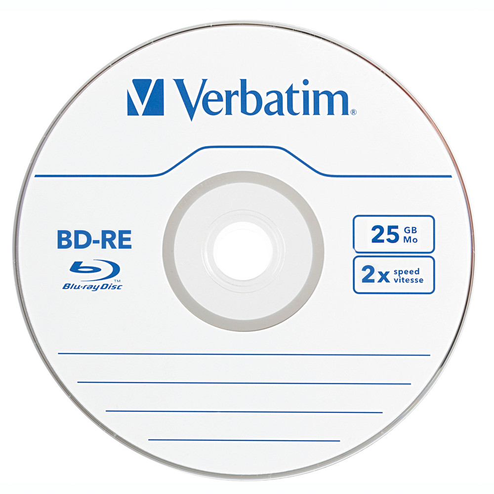</a></td>
    <td>Blu-Ray</td>
    <td>ca. 2000s-present; optical media for high-definition video playback; little archival documentation about Blu-Ray preservation.</td>
    <td><a href="https://en.wikipedia.org/wiki/Blu-ray" target="_blank">Wikipedia</a></td>
  </tr>
</table>

### Floppy disks
Refers to a variety of removable magnetic storage formats encased in a plastic diskette. Consider using <a href="https://www.kryoflux.com/" target="_blank">Kryoflux</a> to obtain a disk image of your floppy disk if you do not know the exact file system of your media. Check out <a href="https://docs.google.com/document/d/1LViSnYpvr2jf1TrCh6ELuL-FWo14ICw-WZeb8j5GGpU/edit" target="_blank">The Archivist's Guide to Kryoflux</a> for further details. Depending on formats, you may need to [emulate](emulators.html) a specific [operating system](operating_systems.html) to read files on the disk.
<table style="width:100%">
  <tr>
    <th>Image</th>
    <th>Format Name</th>
    <th>Description</th>
    <th>Preservation Resources</th>
  </tr>
  <tr>
    <td></td>
    <td>8" floppy disk</td>
    <td>ca. 1970s; IBM-designed device, earliest version had a capacity of 80KB. Used primarily in corporate contexts.</td>
    <td><a href="http://openpreservation.org/blog/2016/09/01/an-8-floppy-disk-challenge/" target="_blank">"An 8" Floppy Disk Challenge"</a></td>
  </tr>
  <tr>
    <td></td>
    <td>5.25" floppy disk</td>
    <td>ca. late 1970s-1980s; flexible, thin, square disk. Magnetic media, single or double-sided, with capacities up to 1.2MB</td>
    <td><a href="http://www.esocop.org/docs/HowToDiagnoseAndRepairIBMFloppy5.pdf" target="_blank">"How To Diagnose and Repair an IBM floppy drive"</a></td>
  </tr>
  <tr>
    <td></td>
    <td>3.5" floppy disk</td>
    <td>ca. 1990s; Extremely common in personal and corporate computing. Rigid plastic disks, often with a write protection tab (engage this for archival purposes!). </td>
    <td><a href="https://practicaltechnologyforarchives.org/issue2_waugh/" target="_blank">"A Dogged Pursuit: Capturing Forensic Images of 3.5” Floppy Disks"</a></td>
  </tr>
  <tr>
    <td><a href="images/full-sized/video-floppy.png">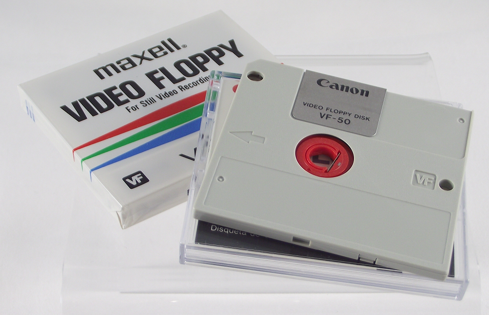</a></td>
    <td>2" Video Floppy</td>
    <td>ca. 1980s-early 1990s; Analog storage medium, could hold up to 25 still frames of composite NTSC or PAL video. Very little documentation from an archival perspective.</td>
    <td><a href="https://en.wikipedia.org/wiki/Video_Floppy" target="_blank">Wikipedia</a></td>
  </tr>
  <tr>
    <td><a href="images/full-sized/floptical.jpg">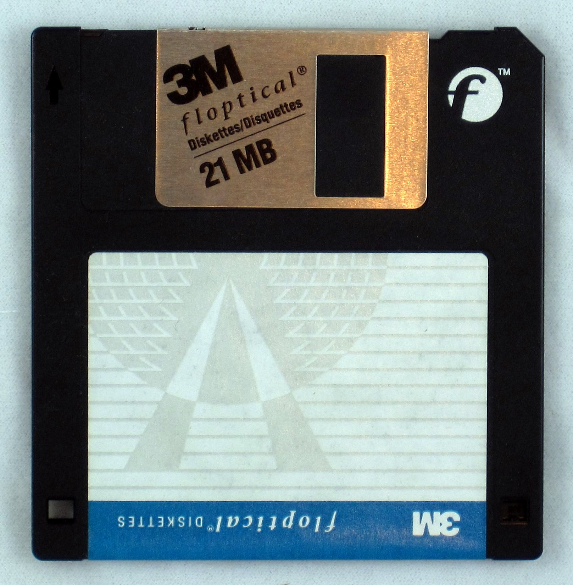</a></td>
    <td>Floptical</td>
    <td>ca. 1990s; Looks like a regular 3.5" floppy disk but combines optical and magnetic technologies for data storage, up to 21MB.</td>
    <td><a href="https://www.nyu.edu/tisch/preservation/program/student.../04f_1805_taylor_a1.doc" target="_blank">MIAP paper by Irene Taylor, 2004</a></td>
  </tr>
  <tr>
    <td></td>
    <td>2.8" DataDisk</td>
    <td>ca. late 1980s; Slightly smaller than 3.5" floppy, double-sided. Very little archival documentation; rare format. Drives difficult to locate, bit rot likely</td>
    <td><a href="http://www.obsoletemedia.org/2-8-inch-datadisk/" target="_blank">Museum of Obsolete Media</a></td>
  </tr>
</table>

### Proprietary Sony-specific Formats
<table style="width:100%">
  <tr>
    <th>Image</th>
    <th>Format Name</th>
    <th>Description</th>
    <th>Preservation Resources</th>
  </tr>
  <tr>
    <td></td>
    <td>Magneto-Optical Disk</td>
    <td>Not to be confused with Floptical. MO discs contain a ferromagnetic material within a plastic cartridge. Manufactured in 5.25" and 3.5" versions, up to 1.3GB. Not exclusively Sony, though they were the primary manufacturer.</td>
    <td><a href="https://en.wikipedia.org/wiki/Magneto-optical_drive" target="_blank">Wikipedia</a></td>
  </tr>
  <tr>
    <td><a href="images/full-sized/sony_memory_stick.png">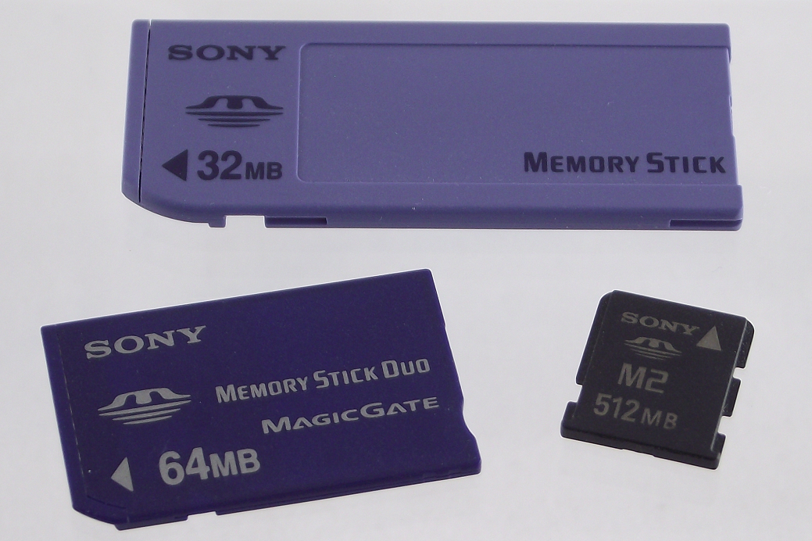</a></td>
    <td>Memory Stick</td>
    <td>ca. late 1990s-early 2000s; flash memory card, eventually superseded by SD cards. Readers and adapters easy to locate through major tech retailers.</td>
    <td><a href="https://wiki.dlib.indiana.edu/display/DIGIPRES/Safe+Handling+of+Born-Digital+Physical+Media" target="_blank">"Safe Handling of Born-Digital Physical Media"</a></td>
  </tr>
  <tr>
    <td><a href="images/full-sized/sony_minidisc.jpg">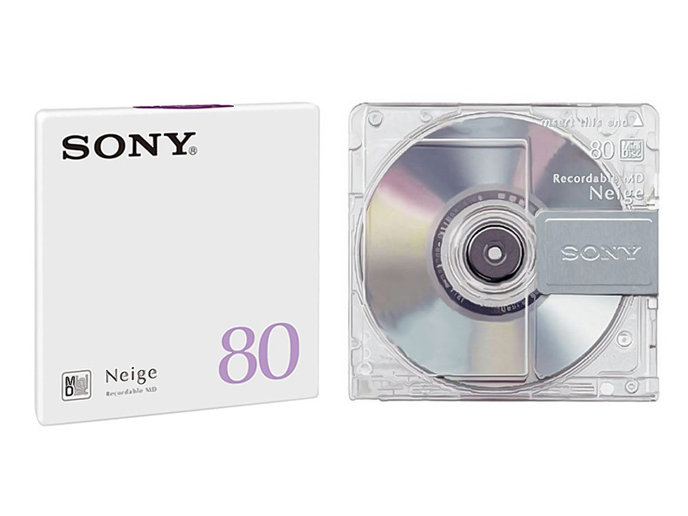</a></td>
    <td>MiniDisc</td>
    <td>ca. 1990s-2000s; variants for both audio and data storage. Magneto-optical technology, 2.75" plastic cartridge with small round disc inside.</td>
    <td><a href="https://www.iasa-web.org/tc04/minidisc" target="_blank">IASA</a>, <a href="http://www.radiosurvivor.com/2015/09/01/preserving-your-audio-legacy-the-perils-of-minidiscs/" target="_blank">Radio Survivor</a></td>
  </tr>
  <tr>
    <td></td>
    <td>Professional Disc / Professional Disc for DATA</td>
    <td>ca. 2003; Video recording and data versions, sometimes referred to as XDCAM discs. DATA variant could hold up to 125GB</td>
    <td><a href="https://www.nyu.edu/tisch/preservation/program/student_work/2010spring/JonahVolk_Thesis_20110908.pdf" target="_blank">MIAP thesis, John Volk, 2010</a> (addresses issues of file-based digital video, including references to XDCAM), <a href="https://web.archive.org/web/20050518171330/http://www.sony.net:80/Products/MO-Drive/ProDATA/pdf/proData_E.pdf" target="_blank">Sony Professional Disc DATA catalog (Wayback Machine)</a></td>
  </tr>
</table>

### Cartridge-based media (Iomega and others)

<table style="width:100%">
  <tr>
    <th>Image</th>
    <th>Format Name</th>
    <th>Description</th>
    <th>Preservation Resources</th>
  </tr>
  <tr>
    <td><a href="images/full-sized/bernoulli.png">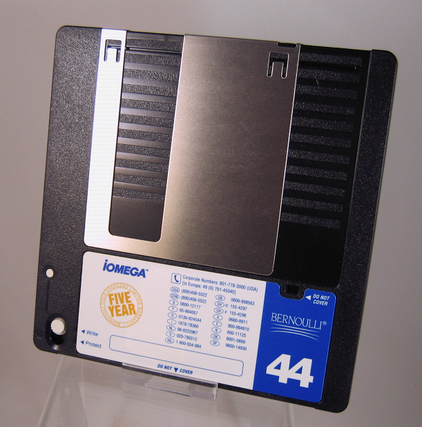</a></td>
    <td>Bernoulli disk</td>
    <td>ca. early 1980s; First major product from Iomega. High-capacity floppy disk format with SCSI interface. Very little archival documentation, though drives are plentiful on eBay for ~$100-200.</td>
    <td><a href="https://en.wikipedia.org/wiki/Bernoulli_Box" target="_blank">Wikipedia</a></td>
  </tr>
  <tr>
    <td><a href="images/full-sized/jaz.jpg">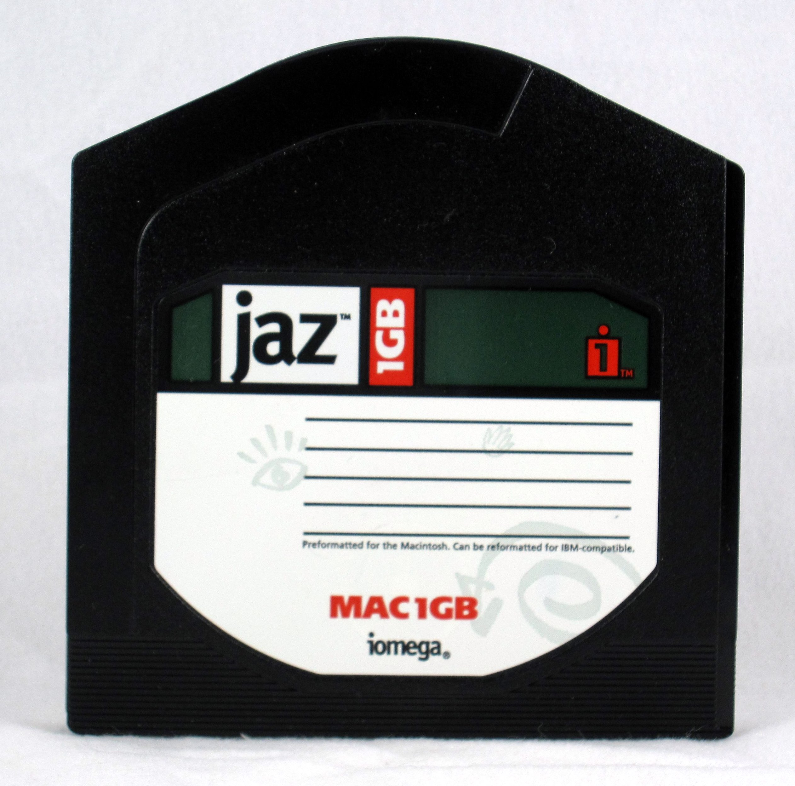</a></td>
    <td>DataPlay disc</td>
    <td>ca. early 2000s; small optical disc enclosed in plastic cartridge. Very little archival documentation; largely unsuccessful format</td>
    <td><a href="https://en.wikipedia.org/wiki/DataPlay" target="_blank">Wikipedia</a></td>
  </tr>
  <tr>
    <td></td>
    <td>Jaz disk</td>
    <td>ca. late 1990s; Iomega removable hard disk, SCSI. Prone to overheating and jams.</td>
    <td><a href="ftp://ftp.wayne.edu/ldp/en/Jaz-Drive-HOWTO/Jaz-Drive-HOWTO.pdf" target="_blank">Herbert S. DaSilva "Jaz-drive HOWTO"</a>, <a href="https://www.nyu.edu/tisch/preservation/program/student_work/2005fall/05f_1805_felixdidier_a2.pdf" target="_blank">MIAP paper, Paula Felix-Didier, 2005</a></td>
  </tr>
  <tr>
    <td><a href="images/full-sized/iomega_clik.gif">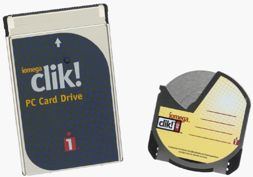</a></td>
    <td>PocketZip/Clik!</td>
    <td>ca. 1999; Iomega product. Thin, small discs that could hold up to 40MB of data. Intended for use in a wide variety of personal electronics. Very little archival footprint, widely considered a failed technology.</td>
    <td><a href="https://youtu.be/-MNxvd_2jkE" target="_blank">Promo video for Clik!</a>, <a href="https://en.wikipedia.org/wiki/PocketZip" target="_blank">Wikipedia</a></td>
  </tr>
  <tr>
    <td></td>
    <td>REV disk</td>
    <td>ca. 2003; Video recording and data versions, sometimes referred to as XDCAM discs. DATA variant could hold up to 125GB</td>
    <td><a href="https://www.nyu.edu/tisch/preservation/program/student_work/2010spring/JonahVolk_Thesis_20110908.pdf" target="_blank">MIAP thesis, John Volk, 2010</a> (addresses issues of file-based digital video, including references to XDCAM)</td>
  </tr>
  <tr>
    <td></td>
    <td>Syquest disk</td>
    <td>ca. 2003; Video recording and data versions, sometimes referred to as XDCAM discs. DATA variant could hold up to 125GB</td>
    <td><a href="https://www.nyu.edu/tisch/preservation/program/student_work/2010spring/JonahVolk_Thesis_20110908.pdf" target="_blank">MIAP thesis, John Volk, 2010</a> (addresses issues of file-based digital video, including references to XDCAM)</td>
  </tr>
  <tr>
    <td></td>
    <td>Zip disk</td>
    <td>ca. 2003; Video recording and data versions, sometimes referred to as XDCAM discs. DATA variant could hold up to 125GB</td>
    <td><a href="https://www.nyu.edu/tisch/preservation/program/student_work/2010spring/JonahVolk_Thesis_20110908.pdf" target="_blank">MIAP thesis, John Volk, 2010</a> (addresses issues of file-based digital video, including references to XDCAM)</td>
  </tr>
  <tr>
    <td></td>
    <td>Zip U250 disk</td>
    <td>ca. 2003; Video recording and data versions, sometimes referred to as XDCAM discs. DATA variant could hold up to 125GB</td>
    <td><a href="https://www.nyu.edu/tisch/preservation/program/student_work/2010spring/JonahVolk_Thesis_20110908.pdf" target="_blank">MIAP thesis, John Volk, 2010</a> (addresses issues of file-based digital video, including references to XDCAM)</td>
  </tr>
</table>

### Other Removable Media
Android phones  
iPhones  
External hard drives  
Secure Digital (SD) Cards  
USB Sticks/Portable Flash Drives/Thumb drives  

### Hardware, Cabling, and Adapters
Information about buying old drives, cables, and adapters
Linking out to the Cable Bible
Potential problems with hardware

## Finally...
If you decide against building a workstation yourself or only have a few objects from which to recover data, consider sending your media out to a trusted data recovery vendor.
