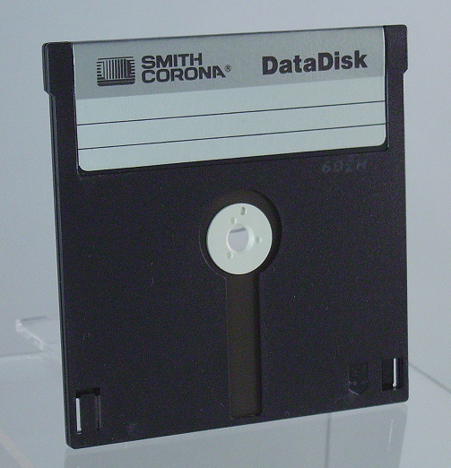

| [ Home ](index.html) | [ Media ID Guide ](media_ID.html) | [ Operating Systems ](operating_systems.html) | [ Emulation ](emulators.html) | [ Resources ](resources.html) |

 

# Media and Hardware Identification Guide

If you are unsure what formats you currently possess, use the images below to help identify your objects. Hover over images for source URLs.  

_Note: This list is not exhaustive! Check out the [Museum of Obsolete Media](http://www.obsoletemedia.org/) for more formats than are listed here._  

## What format(s) do you have in your collection?

- <a href="#optical">Round discs</a>
- <a href="#floppy">Floppy disks</a>
- <a href="#sony">Some unknown Sony format</a>
- <a href="#cartridge">Other cartridge-based media</a>
- <a href="#something-else">None of the above</a>
- <a href="#hardware">I know what formats I have; tell me about hardware, cabling, and adapters</a>

### Optical disc media  
Typically, -R and -RW versions are much more fragile than their commercial read-only counterparts. Fortunately, archivists have written a great deal about optical media preservation, since CDs and CD-Rs are so prevelant in archival collections.  
<table style="width:100%">
  <tr>
    <th>Image</th>
    <th>Format Name</th> 
    <th>Description</th>
    <th>Preservation Resources</th>
  </tr>
  <tr>
    <td></td>
    <td>Compact Disc</td> 
    <td>ca. 1980s-present; The ubiquitous optical format. Numerous varieties, including writeable formats CD-R and CD-RW. A standard CD was introduced for the playback of audio formats.</td>
    <td><a href="http://www.naa.gov.au/information-management/managing-information-and-records/preserving/CDs-and-DVDs.aspx" target="_blank">NAA</a>, <a href="https://www.loc.gov/preservation/scientists/projects/cd-r_dvd-r_rw_longevity.html" target="_blank">LoC</a>, <a href="https://blogs.loc.gov/thesignal/2014/02/getting-public-radios-legacy-off-ageing-rewritable-cds-an-interview-with-wnycs-john-passmore/" target="_blank">LoC/WNYC</a>, <a href="http://campuspress.yale.edu/borndigital/2016/12/20/to-image-or-copy-the-compact-disc-digital-audio-dilemma/" target="_blank">Yale</a></td>  
  </tr>
  <tr>
    <td></td>
    <td>CD-ROM</td> 
    <td>ca. 1980s-1990s; Optical format for data storage, most commonly used for software--programs, video games, artworks. May require more involved a preservation effort than a standard audio CD.</td>
    <td><a href="https://pdfs.semanticscholar.org/6d1b/347b94e2d132a5830fb688c37a4a93f3c8a2.pdf" target="_blank">"Characterization of CD-ROMs for Emulation-based Access"</a>, <a href="https://www.loc.gov/preservation/scientists/projects/cd_longevity.html" target="_blank">"LoC"</a>, <a href="http://www.ncdd.nl/wp-content/uploads/2015/11/201611_DE_Houdbaar_Final_report_CD-ROM_Archiving_DEF.pdf" target="_blank">"NCDD"</a></td>
  </tr>
  <tr>
    <td></td>
    <td>DVD</td> 
    <td>ca. late 1990s-present; optical media for video playback. Numerous varieties, including writable DVD-R and DVD-RW, DVD-ROM, and DVD-RAM</td>
    <td><a href="https://siarchives.si.edu/blog/and-action-ins-and-outs-dvd-video-preservation" target="_blank">Smithsonian Institution Archives</a>, <a href="https://www.nyu.edu/tisch/preservation/program/student_work/2016fall/16f_2920_Oliveira_a2.pdf" target="_blank">MIAP paper by Caroline Olivera, 2016</a>, <a href="https://www.avpreserve.com/wp-content/uploads/2014/04/OpticalMediaPreservation.pdf" target="_blank">AVPS</a></td>
  </tr>
  <tr>
    <td></td>
    <td>Blu-Ray</td> 
    <td>ca. 2000s-present; optical media for high-definition video playback; little archival documentation about Blu-Ray preservation.</td>
    <td><a href="https://en.wikipedia.org/wiki/Blu-ray" target="_blank">Wikipedia</a></td>
  </tr>
</table>  

### Floppy disks  
Refers to a variety of removable magnetic storage formats encased in a plastic diskette. Consider using <a href="https://www.kryoflux.com/" target="_blank">Kryoflux</a> to obtain a disk image of your floppy disk if you do not know the exact file system of your media. Check out <a href="https://docs.google.com/document/d/1LViSnYpvr2jf1TrCh6ELuL-FWo14ICw-WZeb8j5GGpU/edit" target="_blank">The Archivist's Guide to Kryoflux</a> for further details. Depending on formats, you may need to [emulate](emulators.html) a specific [operating system](operating_systems.html) to read files on the disk.
<table style="width:100%">
  <tr>
    <th>Image</th>
    <th>Format Name</th> 
    <th>Description</th>
    <th>Preservation Resources</th>
  </tr>
  <tr>
    <td></td>
    <td>8" floppy disk</td> 
    <td>ca. 1970s; IBM-designed device, earliest version had a capacity of 80KB. Used primarily in corporate contexts.</td>
    <td><a href="http://openpreservation.org/blog/2016/09/01/an-8-floppy-disk-challenge/" target="_blank">"An 8" Floppy Disk Challenge"</a></td>
  </tr>
  <tr>
    <td></td>
    <td>5.25" floppy disk</td> 
    <td>ca. late 1970s-1980s; flexible, thin, square disk. Magnetic media, single or double-sided, with capacities up to 1.2MB</td>
    <td><a href="http://www.esocop.org/docs/HowToDiagnoseAndRepairIBMFloppy5.pdf" target="_blank">"How To Diagnose and Repair an IBM floppy drive"</a></td>
  </tr>
  <tr>
    <td></td>
    <td>3.5" floppy disk</td> 
    <td>ca. 1990s; Extremely common in personal and corporate computing. Rigid plastic disks, often with a write protection tab (engage this for archival purposes!). </td>
    <td><a href="https://practicaltechnologyforarchives.org/issue2_waugh/" target="_blank">"A Dogged Pursuit: Capturing Forensic Images of 3.5” Floppy Disks"</a></td>
  </tr>
  <tr>
    <td></td>
    <td>2" Video Floppy</td> 
    <td>ca. 1980s-early 1990s; Analog storage medium, could hold up to 25 still frames of composite NTSC or PAL video. Very little documentation from an archival perspective.</td>
    <td><a href="https://en.wikipedia.org/wiki/Video_Floppy" target="_blank">Wikipedia</a></td>
  </tr>
  <tr>
    <td></td>
    <td>Floptical</td> 
    <td>ca. 1990s; Looks like a regular 3.5" floppy disk but combines optical and magnetic technologies for data storage, up to 21MB.</td>
    <td><a href="https://www.nyu.edu/tisch/preservation/program/student.../04f_1805_taylor_a1.doc" target="_blank">MIAP paper by Irene Taylor, 2004</a></td>
  </tr>
  <tr>
    <td></td>
    <td>2.8" DataDisk</td> 
    <td>ca. late 1980s; Slightly smaller than 3.5" floppy, double-sided. Very little archival documentation; rare format. Drives difficult to locate, bit rot likely</td>
    <td><a href="http://www.obsoletemedia.org/2-8-inch-datadisk/" target="_blank">Museum of Obsolete Media</a></td>
  </tr>
</table>

### Proprietary Sony-specific Formats  
Magneto-Optical disk  
MiniDisc  
MD Data  
Professional Disc / Professional Disc for data  
Memory Stick  

### Cartridge-based media
Bernoulli disk  
DataPlay Disc  
Jaz disk  
PocketZip/Clik!  
REV disk  
Syquest disk  
Zip disk  
Zip U250 disk

### Other Removable Media
Android phones  
iPhones  
External hard drives  
Secure Digital (SD) Cards  
USB Sticks/Portable Flash Drives/Thumb drives   

### Hardware, Cabling, and Adapters
Information about buying old drives, cables, and adapters    
Linking out to the Cable Bible  
Potential problems with hardware  

## Finally...
If you decide against building a workstation yourself or only have a few objects from which to recover data, consider sending your media out to a trusted data recovery vendor.
