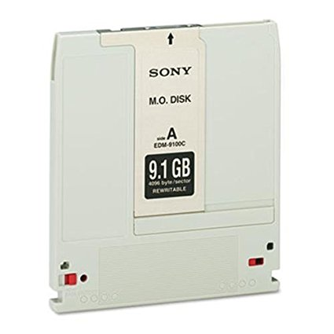
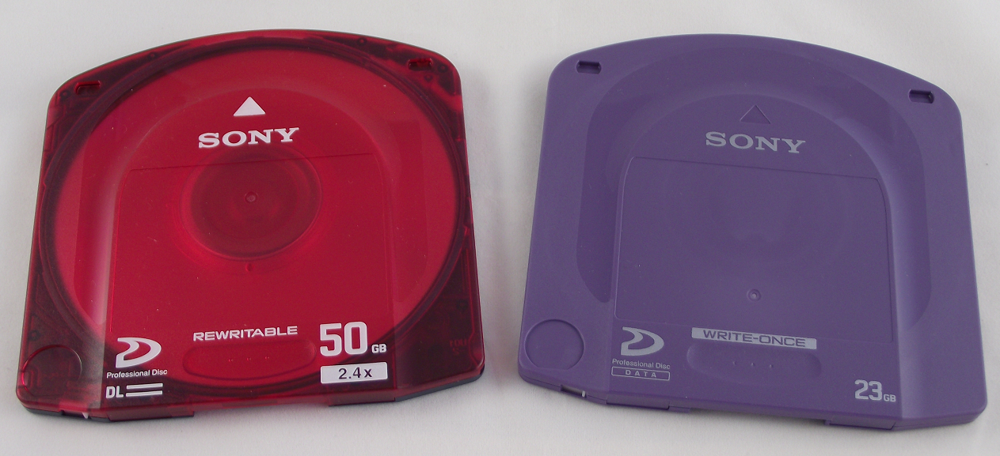
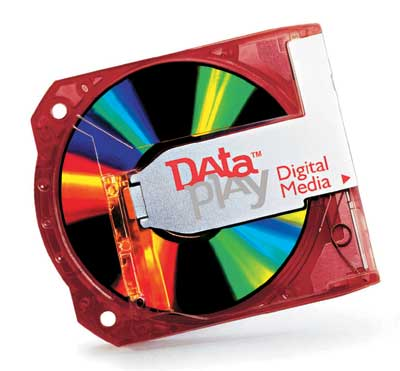
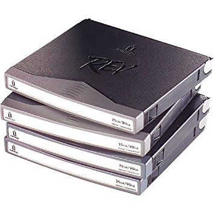
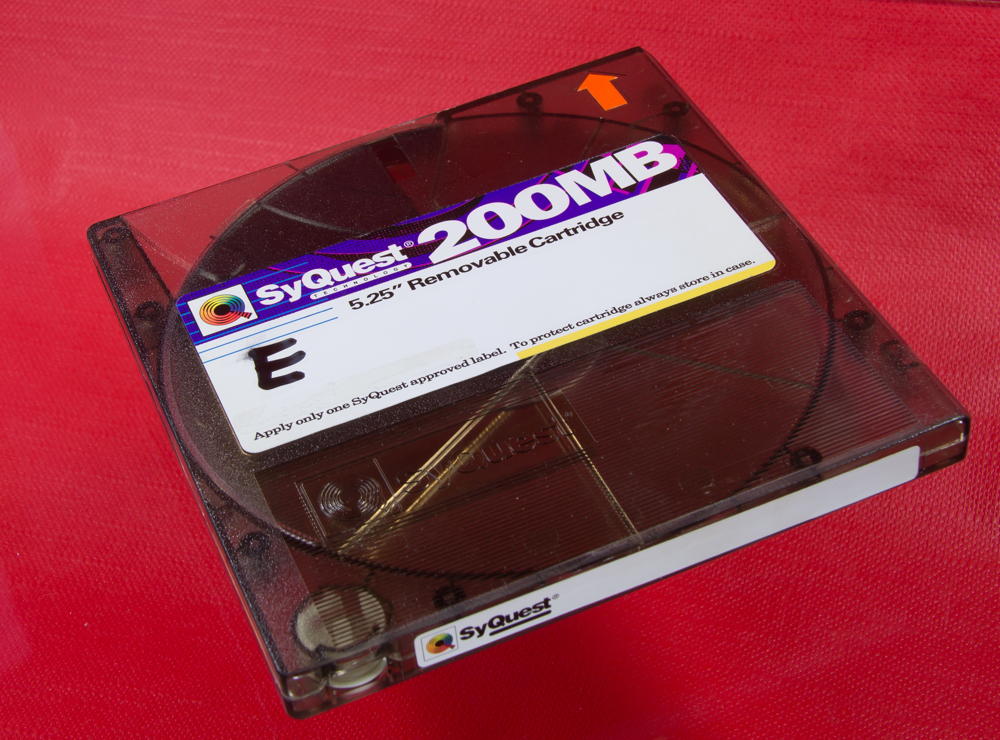
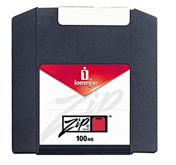
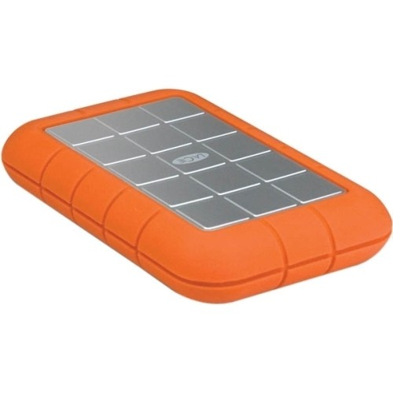
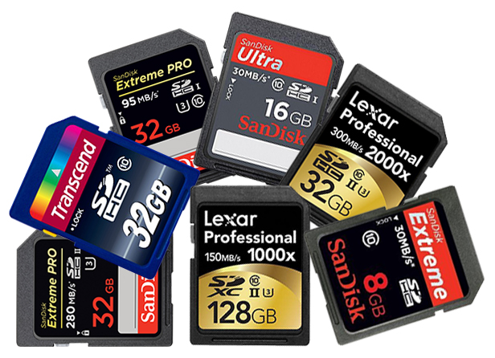
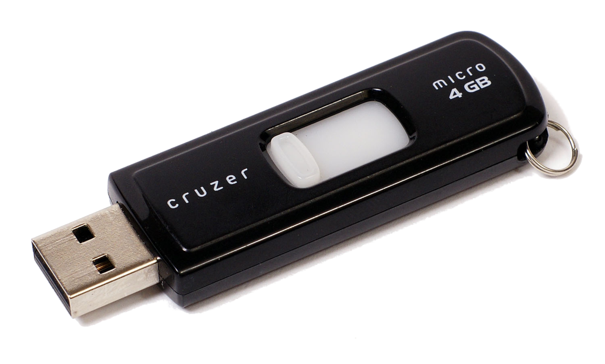

| [ Home ](index.html) | [ Media ID Guide ](media_ID.html) | [ Operating Systems ](operating_systems.html) | [ Emulation ](emulators.html) | [ Resources ](resources.html) |

# Media and Hardware Identification Guide

If you are unsure what formats you currently possess, use the images below to help identify your objects. Click to enlarge images and hover over images for source URLs.

_Note: This list is by no means exhaustive, and some of the formats listed below are widely used today and not currently obsolete! Check out the [Museum of Obsolete Media](http://www.obsoletemedia.org/) for more formats than are listed here._

## What format(s) do you have in your collection?

- <a href="#optical">Round optical discs</a>
- <a href="#floppy">Floppy disks</a>
- <a href="#sony">Some unknown Sony format</a>
- <a href="#cartridge">Other cartridge-based media</a>
- <a href="#something-else">None of the above</a>
- <a href="#hardware">I know what formats I have; tell me about hardware, cabling, and adapters</a>

### Optical disc media
Typically, -R and -RW versions are much more fragile than their commercial read-only counterparts. Fortunately, archivists have written a great deal about optical media preservation, since CDs and CD-Rs are so prevelant in archival collections.
<table style="width:100%">
  <tr>
    <th>Image</th>
    <th>Format Name</th>
    <th>Description</th>
    <th>Preservation Resources</th>
  </tr>
  <tr>
    <td></td>
    <td>Compact Disc</td>
    <td>ca. 1980s-present; The ubiquitous optical format. Numerous varieties, including writeable formats CD-R and CD-RW. A standard CD was introduced for the playback of audio formats.</td>
    <td><a href="http://www.naa.gov.au/information-management/managing-information-and-records/preserving/CDs-and-DVDs.aspx" target="_blank">NAA</a>, <a href="https://www.loc.gov/preservation/scientists/projects/cd-r_dvd-r_rw_longevity.html" target="_blank">LoC</a>, <a href="https://blogs.loc.gov/thesignal/2014/02/getting-public-radios-legacy-off-ageing-rewritable-cds-an-interview-with-wnycs-john-passmore/" target="_blank">LoC/WNYC</a>, <a href="http://campuspress.yale.edu/borndigital/2016/12/20/to-image-or-copy-the-compact-disc-digital-audio-dilemma/" target="_blank">Yale</a></td>
  </tr>
  <tr>
    <td></td>
    <td>CD-ROM</td>
    <td>ca. 1980s-1990s; Optical format for data storage, most commonly used for software--programs, video games, artworks. May require more involved a preservation effort than a standard audio CD.</td>
    <td><a href="https://pdfs.semanticscholar.org/6d1b/347b94e2d132a5830fb688c37a4a93f3c8a2.pdf" target="_blank">"Characterization of CD-ROMs for Emulation-based Access"</a>, <a href="https://www.loc.gov/preservation/scientists/projects/cd_longevity.html" target="_blank">LoC</a>, <a href="http://www.ncdd.nl/wp-content/uploads/2015/11/201611_DE_Houdbaar_Final_report_CD-ROM_Archiving_DEF.pdf" target="_blank">NCDD</a></td>
  </tr>
  <tr>
    <td></td>
    <td>DVD</td>
    <td>ca. late 1990s-present; optical media for video playback. Numerous varieties, including writable DVD-R and DVD-RW, DVD-ROM, and DVD-RAM</td>
    <td><a href="https://siarchives.si.edu/blog/and-action-ins-and-outs-dvd-video-preservation" target="_blank">Smithsonian Institution Archives</a>, <a href="https://www.nyu.edu/tisch/preservation/program/student_work/2016fall/16f_2920_Oliveira_a2.pdf" target="_blank">MIAP paper by Caroline Olivera, 2016</a>, <a href="https://www.avpreserve.com/wp-content/uploads/2014/04/OpticalMediaPreservation.pdf" target="_blank">AV Preserve</a></td>
  </tr>
  <tr>
    <td></td>
    <td>Blu-Ray</td>
    <td>ca. 2000s-present; optical media for high-definition video playback; little archival documentation about Blu-Ray preservation.</td>
    <td><a href="https://en.wikipedia.org/wiki/Blu-ray" target="_blank">Wikipedia</a></td>
  </tr>
</table>

### Floppy disks
Refers to a variety of removable magnetic storage formats encased in a plastic diskette. Consider using <a href="https://www.kryoflux.com/" target="_blank">Kryoflux</a> to obtain a disk image of your floppy disk if you do not know the exact file system of your media. Check out <a href="https://docs.google.com/document/d/1LViSnYpvr2jf1TrCh6ELuL-FWo14ICw-WZeb8j5GGpU/edit" target="_blank">The Archivist's Guide to Kryoflux</a> for further details. Depending on formats, you may need to [emulate](emulators.html) a specific [operating system](operating_systems.html) to read files on the disk.
<table style="width:100%">
  <tr>
    <th>Image</th>
    <th>Format Name</th>
    <th>Description</th>
    <th>Preservation Resources</th>
  </tr>
  <tr>
    <td></td>
    <td>8" floppy disk</td>
    <td>ca. 1970s; IBM-designed device, earliest version had a capacity of 80KB. Used primarily in corporate contexts.</td>
    <td><a href="http://openpreservation.org/blog/2016/09/01/an-8-floppy-disk-challenge/" target="_blank">"An 8" Floppy Disk Challenge"</a>, <a href="https://ipres2017.jp/wp-content/uploads/54Denise-de-VriesA.pdf" target="_blank">"A Case Study on Retrieval of Data from 8-inch Disks"</a></td>
  </tr>
  <tr>
    <td></td>
    <td>5.25" floppy disk</td>
    <td>ca. late 1970s-1980s; flexible, thin, square disk. Magnetic media, single or double-sided, with capacities up to 1.2MB</td>
    <td><a href="http://www.esocop.org/docs/HowToDiagnoseAndRepairIBMFloppy5.pdf" target="_blank">"How To Diagnose and Repair an IBM floppy drive"</a></td>
  </tr>
  <tr>
    <td></td>
    <td>3.5" floppy disk</td>
    <td>ca. 1990s; Extremely common in personal and corporate computing. Rigid plastic disks, often with a write protection tab (engage this for archival purposes!). </td>
    <td><a href="http://www.os2museum.com/wp/preserving-floppies/" target="_blank">Necasek, "Preserving Floppies"</a>, <a href="https://practicaltechnologyforarchives.org/issue2_waugh/" target="_blank">Waugh, "A Dogged Pursuit: Capturing Forensic Images of 3.5” Floppy Disks"</a></td>
  </tr>
  <tr>
    <td></td>
    <td>2" Video Floppy</td>
    <td>ca. 1980s-early 1990s; Analog storage medium, could hold up to 25 still frames of composite NTSC or PAL video. Very little documentation from an archival perspective.</td>
    <td><a href="https://en.wikipedia.org/wiki/Video_Floppy" target="_blank">Wikipedia</a></td>
  </tr>
  <tr>
    <td></td>
    <td>Floptical</td>
    <td>ca. 1990s; Looks like a regular 3.5" floppy disk but combines optical and magnetic technologies for data storage, up to 21MB.</td>
    <td><a href="https://www.nyu.edu/tisch/preservation/program/student.../04f_1805_taylor_a1.doc" target="_blank">MIAP paper by Irene Taylor, 2004</a></td>
  </tr>
  <tr>
    <td></td>
    <td>2.8" DataDisk</td>
    <td>ca. late 1980s; Slightly smaller than 3.5" floppy, double-sided. Very little archival documentation; rare format. Drives difficult to locate, bit rot likely</td>
    <td><a href="http://www.obsoletemedia.org/2-8-inch-datadisk/" target="_blank">Museum of Obsolete Media</a></td>
  </tr>
</table>

### Proprietary Sony-specific Formats
Sony produced a variety of removable media formats throughout the 1990s and 2000s, to varying degrees of success. Fortunately, since Sony was and remains a household name in personal computing, locating functioning decks should not be terribly difficult.  
<table style="width:100%">
  <tr>
    <th>Image</th>
    <th>Format Name</th>
    <th>Description</th>
    <th>Preservation Resources</th>
  </tr>
  <tr>
    <td></td>
    <td>Magneto-Optical Disk</td>
    <td>Not to be confused with Floptical. MO discs contain a ferromagnetic material within a plastic cartridge. Manufactured in 5.25" and 3.5" versions, up to 1.3GB. Not exclusively Sony, though they were the primary manufacturer.</td>
    <td><a href="https://en.wikipedia.org/wiki/Magneto-optical_drive" target="_blank">Wikipedia</a></td>
  </tr>
  <tr>
    <td></td>
    <td>Memory Stick</td>
    <td>ca. late 1990s-early 2000s; flash memory card, eventually superseded by SD cards. Readers and adapters easy to locate through major tech retailers.</td>
    <td><a href="https://wiki.dlib.indiana.edu/display/DIGIPRES/Safe+Handling+of+Born-Digital+Physical+Media" target="_blank">"Safe Handling of Born-Digital Physical Media"</a></td>
  </tr>
  <tr>
    <td></td>
    <td>MiniDisc</td>
    <td>ca. 1990s-2000s; variants for both audio and data storage. Magneto-optical technology, 2.75" plastic cartridge with small round disc inside.</td>
    <td><a href="https://www.iasa-web.org/tc04/minidisc" target="_blank">IASA</a>, <a href="http://www.radiosurvivor.com/2015/09/01/preserving-your-audio-legacy-the-perils-of-minidiscs/" target="_blank">Radio Survivor</a></td>
  </tr>
  <tr>
    <td></td>
    <td>Professional Disc / Professional Disc for DATA</td>
    <td>ca. 2003; Video recording and data versions, sometimes referred to as XDCAM discs. DATA variant could hold up to 125GB</td>
    <td><a href="https://www.nyu.edu/tisch/preservation/program/student_work/2010spring/JonahVolk_Thesis_20110908.pdf" target="_blank">MIAP thesis, Jonah Volk, 2010</a> (addresses issues of file-based digital video, including references to XDCAM), <a href="https://web.archive.org/web/20050518171330/http://www.sony.net:80/Products/MO-Drive/ProDATA/pdf/proData_E.pdf" target="_blank">Sony Professional Disc DATA catalog (Wayback Machine)</a></td>
  </tr>
</table>  

### Cartridge-based media (Iomega and other brands)  
Before their absorption by Lenovo in 2013, Iomega was one of the most notable manufacturers of removable media, though often to <a href="http://www.geocities.ws/iomegano/" target="_blank">disastrous results</a>. Iomega and other cartridge-based drives can be difficult to locate due to their extreme specificity and often relative obscurity. The majority of the disks listed below connected via SCSI interface. The Zip drive even made an <a href="https://i.imgur.com/lwz8mWD.gifv" target="_blank">appearance</a> in a 2001 episode of <i>Sex and the City</i>
<table style="width:100%">
  <tr>
    <th>Image</th>
    <th>Format Name</th>
    <th>Description</th>
    <th>Preservation Resources</th>
  </tr>
  <tr>
    <td></td>
    <td>Bernoulli disk</td>
    <td>ca. early 1980s; First major product from Iomega. High-capacity floppy disk format with SCSI interface. Very little archival documentation, though drives are plentiful on eBay for ~$100-200.</td>
    <td><a href="https://en.wikipedia.org/wiki/Bernoulli_Box" target="_blank">Wikipedia</a></td>
  </tr>
  <tr>
    <td></td>
    <td>DataPlay disc</td>
    <td>ca. early 2000s; small optical disc enclosed in plastic cartridge. Very little archival documentation; largely unsuccessful format</td>
    <td><a href="https://en.wikipedia.org/wiki/DataPlay" target="_blank">Wikipedia</a></td>
  </tr>
  <tr>
    <td></td>
    <td>Jaz disk</td>
    <td>ca. late 1990s; Iomega removable hard disk, SCSI. Prone to overheating and jams.</td>
    <td><a href="ftp://ftp.wayne.edu/ldp/en/Jaz-Drive-HOWTO/Jaz-Drive-HOWTO.pdf" target="_blank">Herbert S. DaSilva "Jaz-drive HOWTO"</a>, <a href="http://campuspress.yale.edu/borndigital/2013/02/08/imagingjazdisks/" target="_blank">Yale, "Imaging Jaz Disks"</a>, <a href="https://www.nyu.edu/tisch/preservation/program/student_work/2005fall/05f_1805_felixdidier_a2.pdf" target="_blank">MIAP paper, Paula Felix-Didier, 2005</a></td>
  </tr>
  <tr>
    <td></td>
    <td>PocketZip/Clik!</td>
    <td>ca. 1999; Iomega product. Thin, small discs that could hold up to 40MB of data. Intended for use in a wide variety of personal electronics. Very little archival footprint, widely considered a failed technology.</td>
    <td><a href="https://youtu.be/-MNxvd_2jkE" target="_blank">Promo video for Clik!</a>, <a href="https://en.wikipedia.org/wiki/PocketZip" target="_blank">Wikipedia</a></td>
  </tr>
  <tr>
    <td></td>
    <td>REV disk</td>
    <td>ca. early 2000s; Iomega high-capacity disk drive. High failure rates and little archival documentation.</td>
    <td><a href="https://web.library.yale.edu/sites/default/files/files/Yale_Inventory_Final_Report_20151021.pdf" target="_blank">AV Preserve Yale collection inventory</a> (in which REV disks are briefly mentioned)</td>
  </tr>
  <tr>
    <td></td>
    <td>Syquest disk</td>
    <td>ca. late 1980s-early 1990s; 5.25" cartridges, primarily used on Macintosh computers via SCSI interface.</td>
    <td><a href="https://web.library.yale.edu/news/2013/09/collaboration-preservation-recovering-born-digital-records" target="_blank">Yale University Library, "Collaboration Before Preservation: Recovering Born Digital Records in the Stephen Gendin Papers"</a>, <a href="https://matienzo.org/2013/collaboration-before-preservation-recovering-born-digital-records-in-the-stephen-gendin-papers/" target="_blank">alternative link (with photographs)</a>, <a href="http://goughlui.com/2013/07/28/project-a-long-fogotten-syquest-cartridge-visits/" target="_blank">Dr Gough's Tech Zone</a></td>
  </tr>
  <tr>
    <td></td>
    <td>Zip disk</td>
    <td>ca. 1990s; 3.5", Considered a "superfloppy" technology due to its relatively high capacity of up to 750MB. Various drives employed various connections, including USB 1.1, 2.0, Firewire, SCSI, Parallel Port, and ATAPI</td>
        <td><a href="https://www.nature.com/news/disks-back-from-the-dead-1.21916" target="_blank">Nature.com, "Disks back from the dead"</a>, <a href="https://www.cca.qc.ca/en/issues/3/technology-sometimes-falls-short/49023/how-to-access-digital-files-from-the-nineties" target="_blank">Canadian Centre for Architecture, "How to Access Digital Files from the Nineties"</a>, <a href="https://www.nyu.edu/tisch/preservation/program/student_work/2005fall/05f_1805_singer_a2.pdf" target="_blank">MIAP paper, Martha Singer, 2005</a></td>
  </tr>
</table>  

### Other Removable Media
<table style="width:100%">
  <tr>
    <th>Image</th>
    <th>Format Name</th>
    <th>Description</th>
    <th>Preservation Resources</th>
  </tr>
  <tr>
    <td></td>
    <td>Android smart phones</td>
    <td>ca. late 2000s-present; Mobile operating system developed by Google, modified version of the Linux kernal. Smart phones that run Android are manufactured by a wide variety of companies. Connections may vary depending on device. Since Android-based devices are relatively new, most preservation-minded documentation stems from the digital forensics community. </td>
    <td><a href="http://qanda.digipres.org/26/how-do-i-take-a-forensic-image-of-an-android-smartphone" target="_blank">Digipres.org Q&A</a>, <a href="http://www.d4discovery.com/discover-more/ediscovery-update-7-tips-to-preserve-review-mobile-device-data#sthash.Gy79jAXh.dpbs" target="_blank">"7 Tips to Preserve and Review Mobile Device Data</a> (legal perspective and analysis)</td>
  </tr>
  <tr>
    <td></td>
    <td>iPhones</td>
    <td>ca. 2007-present; Mobile device developed and manufactured by Apple.</td>
    <td><a href="https://www.sfmoma.org/read/theres-no-app-adventures-conserving-old-tech/" target="_blank">SFMOMA</a>, <a href="http://sbotsections.com/wp-content/uploads/2017/11/ball_12-2017-mobile-preservation_iOS.pdf" target="_blank">Ball, "Custodian-Directed Preservation of iPhone Content" (legal perspective)</a>, <a href="https://blogs.bodleian.ox.ac.uk/archivesandmanuscripts/2017/09/28/pasig-2017-smartphones-within-the-changing-landscape-of-digital-preservation/" target="_blank">Bodleian Libraries, "PASIG 2017 Smartphones within the changing landscape of digital preservation"</a></td>
  </tr>
  <tr>
    <td></td>
    <td>External hard disk drives</td>
    <td>ca. 1980s-present; Extremely common form of personal data storage. File systems, capacities, manufacturers, connections all vary. Fortunately no external drive is needed, and if you can attach the HDD to your computer and make a disk image, you are in good shape! If you have a write-blocker, use it.</td>
    <td><a href="http://notepad.benfinoradin.info/2013/09/12/it-takes-a-village-to-save-a-hard-drive/" target="_blank">Fino-Radin, "It Takes a Village to Save a Hard Drive"</a></td>
  </tr>
  <tr>
    <td></td>
    <td>Secure Digital (SD) Cards</td>
    <td>ca. early 2000s-2010s; Portable flash storage for a variety of devices including digital cameras and mobile phones. Variety of sizes and capacities. Requires need a separate card reader, often with a USB connector.</td>
    <td><a href="https://www.nedcc.org/preservation101/session-6/6storage-and-handling-of-media-collections#computer" target="_blank">NEDCC (section 5, "Computer Media")</a></td>
  </tr>
  <tr>
    <td></td>
    <td>USB sticks/thumb drives/portable flash drives</td>
    <td>ca. 2000s-present; USB connection, usually directly to a computer. Low risk, as these devices are still in use. Physical damage common.</td>
    <td><a href="https://www.nedcc.org/preservation101/session-6/6inherent-vice-computer-media#flash" target="_blank">NEDCC</a></td>
  </tr>
</table>  

### Hardware, Cabling, and Adapters
Since drives for the majority of the above listed formats are no longer being manufactured, secondhand sources such as eBay, craigslist, electronics recycling centers, or even office equipment liquidation outlets are your best (and often only) option when sourcing equipment. If possible, set up alerts on these websites to notify you when a particular format, model, or cable is for sale. Be sure to note any descriptions regarding functionality of the piece in question.

Online forums related to the worlds of retro gaming or vintage computing may provide additional advice or direction, in addition to folks within the digital preservation and/or digital forensics communities. 

For information regarding connectors and cabling that can help you successfully attach a drive to a contemporary computer, check out <a href="https://amiaopensource.github.io/cable-bible/" target="_blank">The Cable Bible</a>! 

## Finally...
If you decide against building a workstation yourself or only have a few objects from which to recover data, consider sending your media out to a trusted data recovery vendor.
